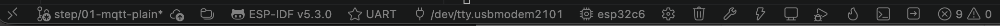
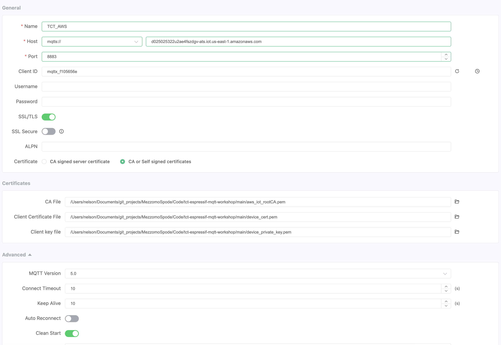
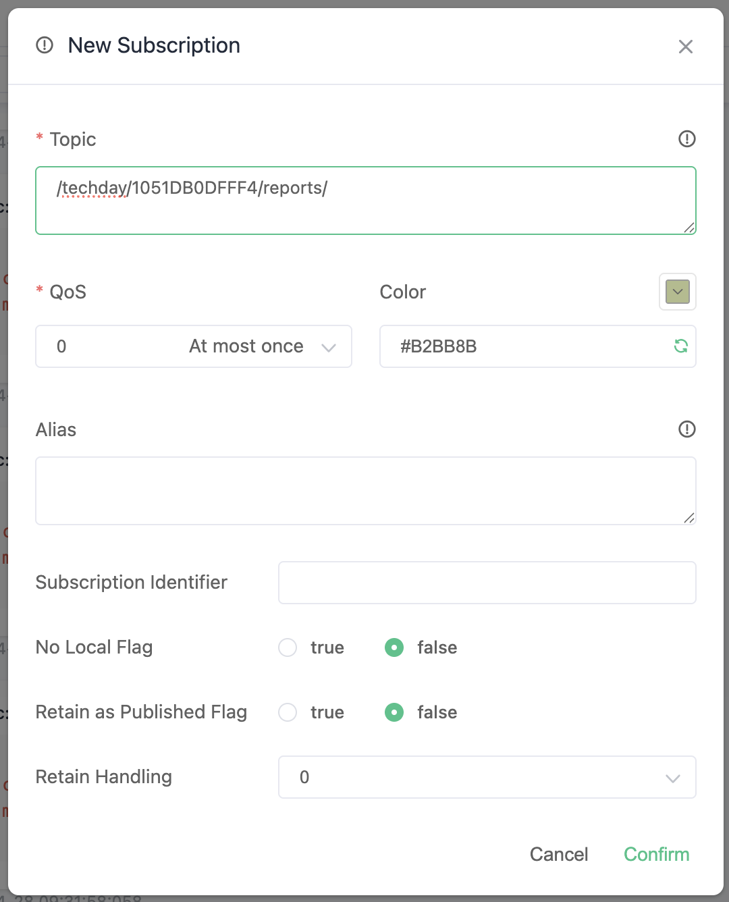

<div style="display: flex; justify-content: center; width: 100%;">
  <div style="position: relative; width: 100%; max-width: 1200px;">
      
  </div>
</div>

<div align="left">

**TCT Brasil 2026 — Espressif Systems**

### Step 01 — MQTT sem TLS (porta 1883)

## O que você vai fazer nesta etapa

Nesta primeira etapa do workshop, vamos estabelecer uma conexão MQTT básica entre a ESP32-C6 e um broker EMQX rodando em uma instância AWS EC2. A comunicação será feita sem criptografia (porta 1883) para demonstrar o funcionamento fundamental do MQTT antes de adicionarmos segurança nas próximas etapas.

## Para completar esta etapa, siga os passos abaixo:

- Configurar a URI do broker e as credenciais Wi-Fi no `settings.h`
- Compilar o firmware e gravar na ESP32-C6
- Monitorar a saída serial e verificar a conexão
- Observar os reports chegando no MQTTX
- Enviar comandos pelo MQTTX para controlar o LED RGB da board

---

## Infraestrutura do lab

```
┌─────────────────┐        MQTT (1883)        ┌──────────────────────┐
│   ESP32-C6      │ ────────────────────────► │   Broker EMQX        │
│  (seu device)   │     sem criptografia      │  AWS EC2             │
└─────────────────┘                           └──────────┬───────────┘
                                                         │
                                                         ▼
                                              ┌──────────────────────┐
                                              │        MQTTX         │
                                              │   (monitoramento)    │
                                              └──────────────────────┘
```

**Broker:** EMQX rodando em instância AWS EC2  
**Endereço:** `ec2-3-80-250-87.compute-1.amazonaws.com`  
**Porta:** `1883` (sem TLS)  
**Cliente de monitoramento:** MQTTX Desktop

### Dashboard EMQX

Acesse o dashboard do broker para monitorar conexões e mensagens em tempo real:

**URL:** [http://ec2-3-80-250-87.compute-1.amazonaws.com:18083/](http://ec2-3-80-250-87.compute-1.amazonaws.com:18083/)

| Campo | Valor |
|---|---|
| Usuário | `admin` |
| Senha | `Techday_2026` |

---

## Passo 1 — Clonar o branch

```bash
git clone --branch step/01-mqtt-plain https://github.com/nelsonspode/tct-espressif-mqtt-workshop.git
cd tct-espressif-mqtt-workshop
```

Ou, se já tiver o repositório clonado, faça o checkout para o branch da etapa 1:

```bash
git checkout step/01-mqtt-plain
```

Ou faça o checkout diretamente pelo VSCode usando a extensão Git.

Para abrir o projeto no VSCode, use:
```bash
code .
```

---

## Passo 2 — Configurar o projeto

Abra o arquivo `main/settings.h` e preencha as definições abaixo:

```cpp
// URI do broker MQTT
#define MQTT_BROKER_URI         "mqtt://ec2-3-80-250-87.compute-1.amazonaws.com:1883"

// Credenciais Wi-Fi
#define PRE_CONFIGURED_WIFI_SSID        "nome-da-rede"
#define PRE_CONFIGURED_WIFI_PASSWORD    "senha-da-rede"
```

> O dispositivo usa o **MAC address** da placa como identificador único — nenhuma outra configuração é necessária para garantir unicidade entre os participantes.

Os tópicos MQTT do seu dispositivo são construídos automaticamente:

```
/techday/<MAC>/reports/   ← reports publicados pelo dispositivo a cada 5s
/techday/<MAC>/commands/  ← comandos que o dispositivo escuta
<MAC>/status/             ← status online/offline automático (LWT)
```

---

## Passo 3 — Compilar e gravar

Selecione a porta serial correta na barra inferior do VSCode (ícone de tomada), depois clique no icone em forma de "fogo". Ao clicar neste ícone, o VSCode irá compilar o projeto, gravar no dispositivo e abrir o monitor serial automaticamente. 



Você deve ver no terminal uma sequência semelhante a:

```
I (xxxx) app: Estação Wi-Fi iniciada
I (xxxx) app: IP obtido: 192.168.x.x
W (xxxx) app: Wi-Fi conectado! Iniciando MQTT...
I (xxxx) app: Device ID (MAC): A1B2C3D4E5F6
I (xxxx) MY_MQTT: Inicializando MQTT...mqtt://ec2-3-80-250-87.compute-1.amazonaws.com:1883
I (xxxx) MY_MQTT: Conectado ao broker MQTT.
I (xxxx) MAIN: Inscrito no tópico: /techday/A1B2C3D4E5F6/commands/
```

> O LED da board ficará **laranja** durante a inicialização.

---

## Passo 4 — Monitorar no MQTTX

Abra o MQTTX Desktop e crie uma nova conexão:

| Campo | Valor |
|---|---|
| Host | `mqtt://ec2-3-80-250-87.compute-1.amazonaws.com` |
| Porta | `1883` |
| Client ID | qualquer nome (ex: `mqttx-monitor`) |



### Assinar os tópicos do seu dispositivo

**Após conectar**, Clique no botão ** + Subscription** e assine os tópicos do seu dispositivo substituindo `<MAC>` pelo endereço exibido no monitor serial:

| Tópico | O que você vai ver |
|---|---|
| `/techday/<MAC>/reports/` | Reports publicados automaticamente a cada 5 segundos |
| `<MAC>/status/` | Status `online` ao conectar, `offline` ao desconectar |
| `#` | Todos os tópicos de todos os dispositivos do lab |



---

## Passo 5 — Enviar comandos para o LED

O dispositivo escuta comandos no tópico `/techday/<MAC>/commands/`. No MQTTX, publique neste tópico com o seguinte payload JSON:

```json
{"command": "set_led", "value": 0}
```

| `value` | Cor do LED |
|---|---|
| `0` |  Laranja |
| `1` |  Vermelho |
| `2` |  Verde |
| `3` |  Azul |

Após receber o comando, o dispositivo publica automaticamente o estado atualizado no tópico de reports.

---

## O que está acontecendo

Nesta etapa a comunicação é **completamente aberta** — os dados trafegam sem nenhuma criptografia. Qualquer dispositivo na mesma rede consegue interceptar as mensagens.

Isso é intencional: o objetivo é mostrar o funcionamento básico do MQTT antes de adicionar segurança nas próximas etapas.

```
ESP32-C6  ──── dados em texto puro ────►  Broker EMQX  ────►  MQTTX
```

### Experimente também

Se terminar antes, explore:

- **LWT na prática:** desconecte o cabo USB e observe o tópico `<MAC>/status/` receber `offline` automaticamente — esse é o Last Will and Testament do MQTT funcionando.
- **Dashboard EMQX:** acesse o dashboard e veja seu dispositivo listado como cliente conectado, os tópicos ativos e o tráfego de mensagens em tempo real.
- **Ajuste o intervalo:** altere o valor de `5000` no `vTaskDelay(pdMS_TO_TICKS(5000))` no `main.cpp` e observe a frequência de publicação mudar no MQTTX.
- **Customize o payload:** modifique a função `publishCurrentState()` no `main.cpp` e adicione novos campos ao JSON publicado.

---

## Troubleshooting

| Problema | Possível causa | Solução |
|---|---|---|
| Porta COM não aparece | Driver USB não instalado | Instale CP210x ou CH343 |
| `idf.py flash` falha | Porta ocupada | Feche o monitor serial antes de gravar |
| Wi-Fi não conecta | SSID/senha incorretos | Revise o `settings.h` |
| MQTT não conecta | URI incorreta ou sem internet | Confirme a URI no `settings.h` e a rede |
| Nenhuma mensagem no MQTTX | Tópico incorreto | Confirme o MAC no monitor serial |
| LED não muda | Comando JSON malformado | Verifique aspas e estrutura do JSON |

---

## Próximo passo

Com a conexão básica funcionando, avance para a etapa 2 onde vamos gerar um certificado autoassinado e adicionar TLS:

```bash
git checkout step/02-mqtt-tls
```

---

<div align="center">
Desenvolvido para o evento <strong>TCT Brasil</strong> pela <strong>Mezzomo e Spode Design House</strong>
</div>

