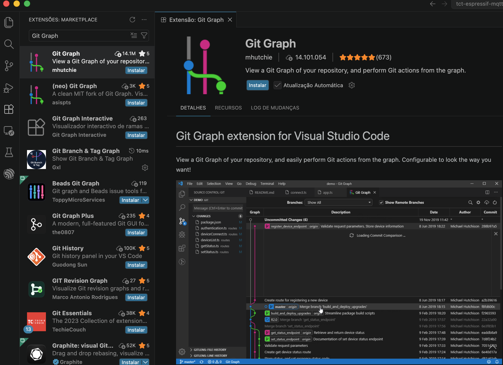

<div style="display: flex; justify-content: center; width: 100%;">
  <div style="position: relative; width: 100%; max-width: 1200px;">
      
  </div>
</div>

<div align="center">

### From plain MQTT to TLS and AWS IoT Core

**TCT Brasil 2026 — Espressif Systems**

</div>

---

<div align="center">


</div>

---

## Sobre este workshop

Hands-on técnico apresentado no evento **Tech Day Road Show 2026, TCT Brasil**, com foco em conectividade MQTT utilizando o **ESP32-C6** como kit de desenvolvimento. A sessão percorre três etapas progressivas: conexão sem segurança, conexão com TLS usando certificado autoassinado, e integração com o **AWS IoT Core**.

**Duração:** 70 minutos  
**Nível:** Intermediário  
**Linguagem:** C++  
**Ferramentas:** ESP32-C6 + ESP-IDF + VSCode

> **Referência:** Para mais informações sobre como utilizar C++ em projetos com o ESP-IDF, consulte o documento [Referência sobre C++ com ESP32-C6](docs/cpp-components.md) na pasta `docs/`.

---

## Apresentador

**Eng. Nelson Spode**  
_Engenheiro Eletricista, Mestre e Doutor pela UFSM — Universidade Federal de Santa Maria_  
Sócio-gestor — [Mezzomo e Spode](https://www.linkedin.com/in/nelsonspode/) | Design House em Hardware e Software com foco em eletrônica Industrial, IoT e Eletrônica de Potência.

[](https://www.linkedin.com/in/nelsonspode/)

---

## Pré-requisitos

Antes do evento, instale e configure os itens abaixo. **A configuração do ambiente não será realizada durante o hands-on.**

### Hardware
- Development board **ESP32-C6** (fornecida no evento)
- Cabo USB-C

### Software

| Item | Versão recomendada | Link |
|---|---|---|
| VSCode | ≥ 1.89 | [code.visualstudio.com](https://code.visualstudio.com/) |
| Extensão ESP-IDF (VSCode) | ≥ 1.9 | Marketplace VSCode |
| ESP-IDF | v5.3.1 | Instalado via extensão |
| MQTTX Desktop | Latest | [mqttx.app](https://mqttx.app/) |
| Driver USB | — | CP210x ou CH343 (veja abaixo) |

### Driver USB
- **Windows/Mac:** instale o driver [CP210x](https://www.silabs.com/developers/usb-to-uart-bridge-vcp-drivers) ou [CH343](https://github.com/WCHSoftGroup/ch343ser_linux) conforme o chip da sua board
- **Linux:** geralmente já incluído no kernel

### OpenSSL
não é necessário, mas é usada em demonstrações para geração do certificado autoassinado na etapa 2.
- **Linux/Mac:** já disponível no terminal
- **Windows:** instale o [Git for Windows](https://gitforwindows.org/) — o Git Bash inclui o `openssl`

---

## Branches — etapas do hands-on

Cada etapa está em um branch dedicado. Acompanhe o diff entre branches para entender exatamente o que muda a cada evolução.

| Branch | Etapa | Descrição | README |
|---|---|---|---|
| `main` | — | Este README e estrutura base do projeto | — |
| `step/01-mqtt-plain` | Etapa 1 | Conexão MQTT sem TLS — porta 1883 | [README](../../tree/step/01-mqtt-plain#readme) |
| `step/02-mqtt-tls` | Etapa 2 | Conexão MQTT com TLS — porta 8883, certificado autoassinado | [README](../../tree/step/02-mqtt-tls#readme) |
| `step/03-aws-iot` | Etapa 3 (bônus) | Integração com AWS IoT Core — mTLS | [README](../../tree/step/03-aws-iot#readme) |

> **Dica:** use `git diff step/01-mqtt-plain step/02-mqtt-tls` para visualizar exatamente o que TLS exige a mais no cliente.

### Ferramentas recomendadas

Para facilitar a navegação entre os branches, recomendamos instalar a extensão **Git Graph** ou **GitLens** no VSCode. Com ela, é possível visualizar o histórico de commits e trocar de branches de forma gráfica e intuitiva.

<div align="center">



</div>

**Instalação:** Busque por "Git Graph" no Marketplace do VSCode ou clique [aqui](https://marketplace.visualstudio.com/items?itemName=mhutchie.git-graph). 

Caso prefira, a extensão **GitLens** também oferece funcionalidades avançadas de visualização de branches e diffs. Procure por "GitLens" no Marketplace ou acesse [aqui](https://marketplace.visualstudio.com/items?itemName=eamodio.gitlens).


---

## Infraestrutura do lab

```
┌─────────────────┐        MQTT         ┌──────────────────┐
│   ESP32-C6      │ ──────────────────► │   Broker EMQX    │
│  (seu device)   │   porta 1883/8883   │   AWS EC2        │
└─────────────────┘                     └────────┬─────────┘
                                                  │
                                                  ▼
                                        ┌──────────────────┐
                                        │      MQTTX       │
                                        │  (monitoramento) │
                                        └──────────────────┘
```

**Broker:** EMQX rodando em instância AWS EC2  
**Broker backup:** VM local (apresentador)  
**Cliente de monitoramento:** MQTTX Desktop

### Dashboard EMQX

**URL:** [http://ec2-3-80-250-87.compute-1.amazonaws.com:18083/](http://ec2-3-80-250-87.compute-1.amazonaws.com:18083/)

| Campo | Valor |
|---|---|
| Usuário | `admin` |
| Senha | `Techday_2026` |

---

## Resumo das etapas

### Etapa 1 — MQTT sem TLS (porta 1883)
> Branch: `step/01-mqtt-plain`

Conexão básica ao broker EMQX sem criptografia. O participante configura Wi-Fi e URI do broker no `settings.h`, grava o firmware e monitora a comunicação no MQTTX. Inclui controle do LED RGB via comandos JSON.

### Etapa 2 — MQTT com TLS (porta 8883)
> Branch: `step/02-mqtt-tls`

Adiciona TLS à conexão usando um certificado CA autoassinado embedado no firmware. O diff em relação à etapa 1 mostra exatamente o que TLS exige a mais no cliente MQTT. O certificado é gerado ao vivo com `openssl` como demonstração.

### Etapa 3 — AWS IoT Core (bônus)
> Branch: `step/03-aws-iot`

Conecta ao AWS IoT Core usando **mTLS** — autenticação mútua com três certificados embedados no firmware. O diff em relação à etapa 2 mostra a diferença entre TLS unilateral e mTLS.

## Vamos começar!

Clone o repositório e faça o checkout para a primeira etapa:

```bash
git clone https://github.com/nelsonspode/tct-espressif-mqtt-workshop.git
cd tct-espressif-mqtt-workshop
git checkout step/01-mqtt-plain
```

Em seguida, abra a pasta no VSCode:

```bash
code .
```

Siga as instruções no README deste branch para configurar e gravar o firmware. Bom workshop! 🚀
---

## Troubleshooting

| Problema | Possível causa | Solução |
|---|---|---|
| Porta COM não aparece | Driver USB não instalado | Instale CP210x ou CH343 |
| `idf.py flash` falha | Porta ocupada | Feche o monitor serial antes de gravar |
| Wi-Fi não conecta | SSID/senha incorretos | Revise o `settings.h` |
| `mbedtls` erro de certificado | Certificado expirado ou CN errado | Consulte o README do branch correspondente |
| MQTTX não recebe mensagens | Tópico incorreto | Confirme o MAC no monitor serial |

---

## Referências

- [ESP-IDF Programming Guide — ESP32-C6](https://docs.espressif.com/projects/esp-idf/en/stable/esp32c6/)
- [ESP-IDF MQTT Client](https://docs.espressif.com/projects/esp-idf/en/stable/esp32c6/api-reference/protocols/mqtt.html)
- [EMQX Documentation](https://docs.emqx.com/)
- [AWS IoT Core Developer Guide](https://docs.aws.amazon.com/iot/latest/developerguide/)
- [MQTTX](https://mqttx.app/)

---

<div align="center">

Desenvolvido para o evento <strong>TCT Brasil</strong> pela <strong>Mezzomo e Spode Design House</strong>

</div>