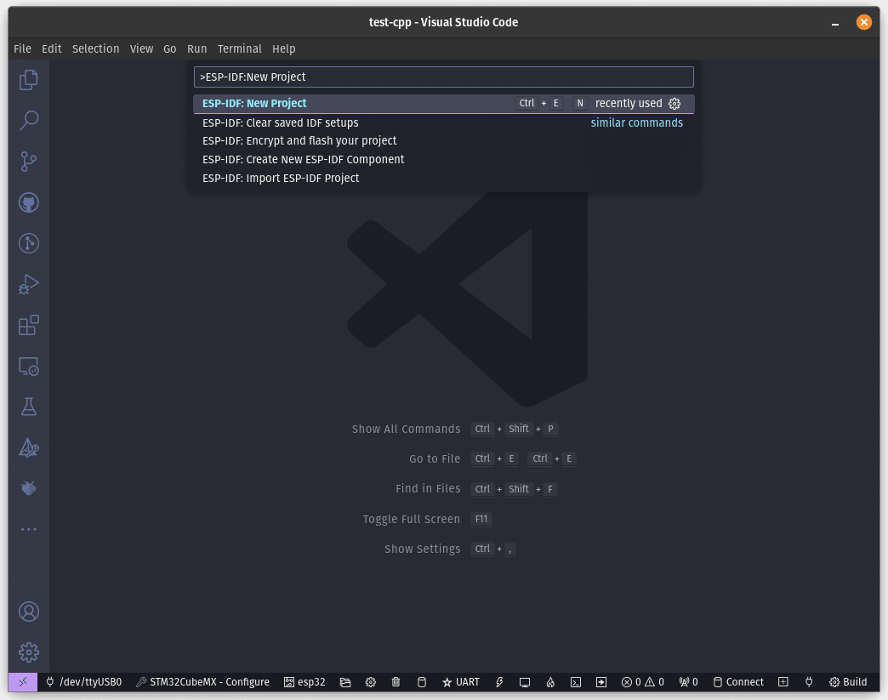
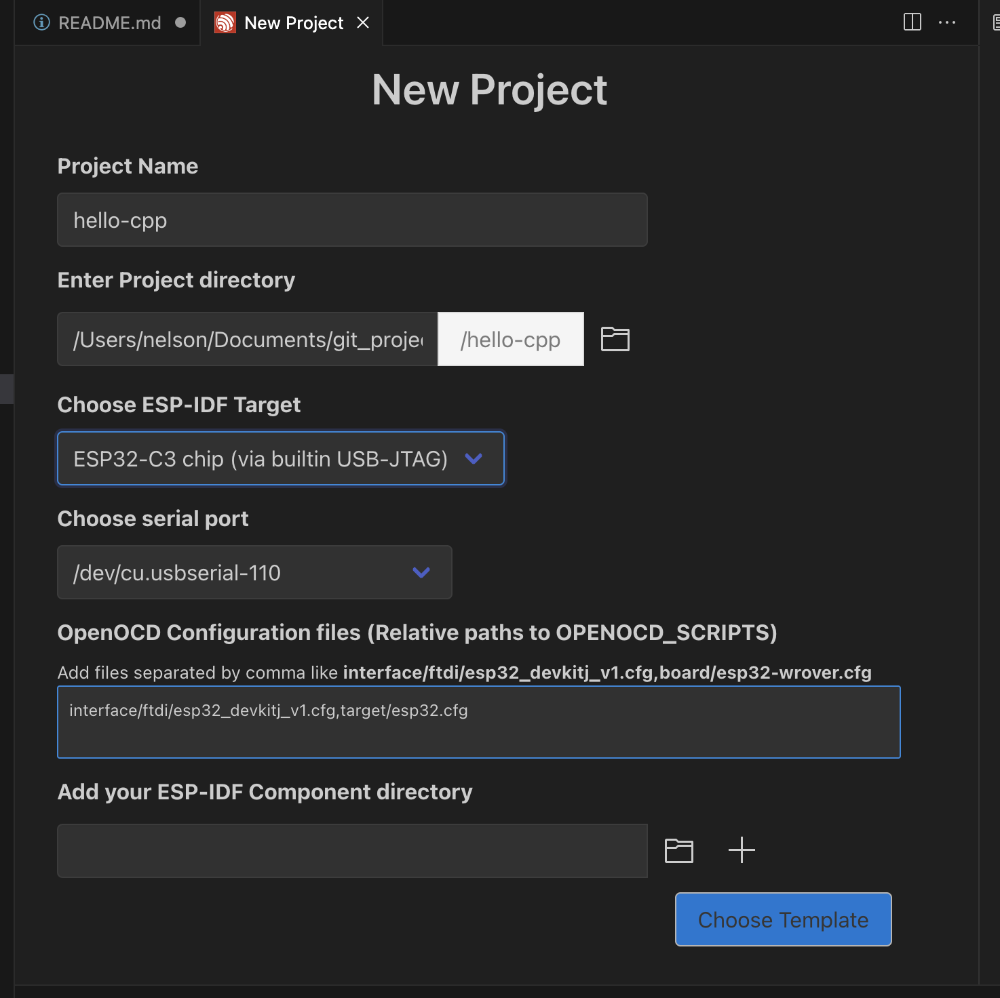
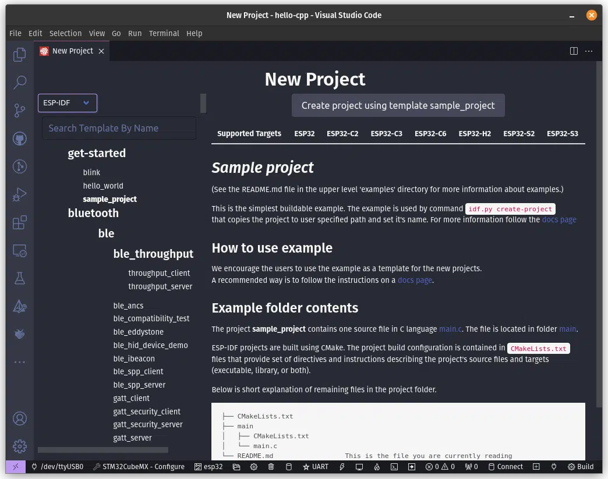
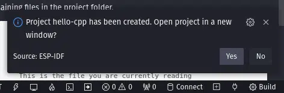

# Referência sobre utilização de C++ com ESP32-C6

**Autor: Nelson Spode**

Este texto é uma referência para a criação de projetos utilizando C++ com o ESP-IDF. Ele pode ser usado como base para a criação de projetos mais complexos.

# Preparando o Ambiente
Para prosseguir, o ESP-IDF já deve ter sido instalado no sistema junto com o VSCode.

Com o ESP-IDF devidamente instalado no sistema e adicionado como extensão no VSCode, deve-se começar a preparar o ambiente para começar a trabalhar com C++. Primeiro, deve-se iniciar um novo projeto na ESP-IDF a partir do exemplo Sample Project, que já vem com todas as configurações necessárias para começar um novo projeto.

Para isso, deve-se seguir os seguintes passos:

Abra o VSCode, aperte F1 e digite ESP-IDF: New Project;



Agora, nomeie o projeto e salve-o como quiser. Aqui, o nomeamos como “hello-cpp”;



Na caixa de seleção acima dos templates disponíveis, selecione **ESP-IDF** e depois **sample_project**. Esse exemplo já vem com todas as configurações necessárias para criar um novo projeto. Com isso, clique em **Create project using sample_project**.



Finalmente, essa caixa de diálogo irá aparecer no canto inferior direito da janela do VSCode. Aperte Yes para abrir o projeto recém-criado em uma nova janela.



- Renomear o arquivo main.c para main.cpp. 

> **Observação:** Existe um componente chamado esp-idf-cxx, que não instalei. É um componente da Espressif para o ESP-IDF que permite o uso de várias bibliotecas e APIs em C++, sendo bem útil para ser usado em projetos C++. Se quiser instalar, ir até o botão ESP-IDF: Open ESP-IDF Terminal, localizado na parte inferior do ambiente do VSCode.


No terminal aberto, digite o seguinte comando e aperte Enter para instalar o componente:

```bash
idf.py add-dependency "espressif/esp-idf-cxx^1.0.2-beta"
```

Depois em main.cpp, o minimo necessário é:
```cpp
#include "freertos/FreeRTOS.h"
#include "freertos/task.h"

#define LOG_LOCAL_LEVEL ESP_LOG_INFO
#include "esp_log.h"
```

o FreeRTOS busca a função app_main, então é preciso linkar a função app_main com a função main. Para isso, adicione o seguinte código no final do arquivo main.cpp:

```cpp
extern "C" void app_main(void)
```

# Criando a pasta components

Recomendo criar uma nova pasta chamada `components` na raiz do projeto. É nessa pasta que serão inseridos os componentes personalizados, deixando o projeto mais organizado e tornando mais fácil realizar a portabilidade em outros projetos. Com isso, deve-se abrir o arquivo **CMakeLists.txt** localizado na raiz do projeto (cuidado para não confundir com o arquivo CMakeLists.txt na pasta main) e acrescente a seguinte linha no arquivo:

```cmake
set(EXTRA_COMPONENT_DIRS components)
```

Essa linha serve para sinalizar ao **CMake** onde está a pasta de componentes recém-criada, para que estes possam ser incluídos corretamente na compilação do código. O arquivo após a adição deve ficar nestes moldes:

```cmake
# For more information about build system see
# https://docs.espressif.com/projects/esp-idf/en/latest/api-guides/build-system.html
# The following five lines of boilerplate have to be in your project's
# CMakeLists in this exact order for cmake to work correctly
cmake_minimum_required(VERSION 3.16)
include($ENV{IDF_PATH}/tools/cmake/project.cmake)
project(hello-cpp)
set(EXTRA_COMPONENT_DIRS components)
```

Com o ambiente preparado, pode-se seguir com a criação dos componentes que serão utilizados no projeto.


# Criando os Componentes
Primeiro, serão criados os objetos a serem usados como componentes do ESP-IDF.

Para isso, deve-se ir até a pasta **components** que foi criada anteriormente e criar uma nova pasta, que aqui será chamada **hello**, onde será criado o componente *Hello World*. Dentro dessa pasta, deve ser criado um novo arquivo **CMakeLists.txt** e ser inserido o seguinte código no mesmo:

```cmake
idf_component_register(SRCS "hello.cpp"
                       INCLUDE_DIRS "include")
```
A finalidade desse arquivo é indicar em quais arquivos-fonte estarão os códigos para o nosso objeto e em qual pasta estarão os headers desse componente. Nesse caso, os mesmos estarão localizados em um arquivo-fonte **hello.cpp** e em uma pasta **include**, respectivamente, os quais serão criados posteriormente.

Agora, deve-se criar uma pasta chamada **include** dentro da pasta **hello**, e dentro desta um arquivo chamado **hello.h**. Nesse arquivo, serão declaradas as classes, variáveis, etc, que serão utilizadas no componente.

Primeiro, deve-se adicionar o **include guard**:

```cpp
// Recursividade para impedir que o header execute mais de uma vez
#ifndef HELLO_H
#define HELLO_H
// Código
#endif
```
Esse padrão de código em arquivos header, conhecido como **include guard** (ou “protetor de inclusão”), é utilizado para evitar inclusões múltiplas de um mesmo arquivo em um projeto. Essa técnica é essencial em C e C++ para prevenir erros de compilação causados por redefinições de variáveis, funções, ou classes quando o mesmo arquivo header é incluído mais de uma vez.

Como funciona

	•	#ifndef HELLO_H: Verifica se a macro HELLO_H não foi definida.
	•	#define HELLO_H: Define a macro HELLO_H para marcar que esse arquivo foi processado.
	•	// Código: Inclui o conteúdo do header que será processado apenas uma vez.
	•	#endif: Finaliza o bloco condicional.

Se o mesmo arquivo for incluído novamente em outro ponto do código, a macro já estará definida, então o conteúdo do header será ignorado.

Com isso, será utilizado um mecanismo de escopo chamado **namespace**, que limita a execução de um trecho de código a apenas o escopo definido dentro do namespace. Isso é útil para evitar conflitos de nomes entre funções e classes, o que pode ocorrer em projetos que utilizam um grande número de objetos.

```cpp
// Recursividade para evitar conflitos de nomes
namespace HELLO
{
    // Código
}
```

Então, será declarada a classe **HelloCpp**, onde será declarada a função **run** onde será executada a função principal do objeto.

```cpp
C++
   // Criação da classe HelloCpp
   class HelloCpp final
   {
       // Declaração da função "run"
       public:
           void run(int i);
   };
```

Segue abaixo o código finalizado do header **hello.h**:

```cpp
C++
// Recursividade para impedir que o header execute mais de uma vez
#ifndef HELLO_H
#define HELLO_H
// Recursividade para evitar conflitos de nomes
namespace HELLO
{
   // Criação da classe HelloCpp
   class HelloCpp final
   {
       // Declaração da função "run"
       public:
           void run(int i);
   };
}
#endif
```

Com o header criado, agora deve-se voltar para a pasta **components/hello** e criar um novo arquivo-fonte que aqui foi chamado **hello.cpp**, onde serão programadas as funções do componente. Com o arquivo criado, deve-se primeiro incluir as bibliotecas que serão utilizadas por esse código. Neste caso, vamos incluir o proprio header do componente - o **hello.h** criado anteriormente e o **esp_log.h**, um componente do ESP-IDF que adiciona vários recursos para  tarefas de logging e debug.

```cpp
// Programação da função "run", que deve exibir a mensagem "Hello C++" com a variável do contador de quantas vezes o programa foi executado
// Definir nível de log e incluir biblioteca de log
#define LOG_LOCAL_LEVEL ESP_LOG_INFO
#include "esp_log.h"
#include "hello.h"
```

Com as bibliotecas incluídas, aqui também será criado um namespace para organizar o código. >**IMPORTANTE:** O NAMESPACE CRIADO AQUI DEVE TER O MESMO NOME DO NAMESPACE CRIADO NO HEADER 'hello.h'.

```cpp
namespace HELLO
{
   // Código
}
```

Com o namespace criado, agora deve ser programada a função run a ser executada pelo objeto **HelloCpp** definido em **hello.h**, que deve exibir no terminal a mensagem “Hello C++” junto com um parâmetro ‘i’ que será definido posteriormente.

```cpp

void HelloCpp::run(int i)
{
    ESP_LOGI("DEBUG", "Hello C++ %d", i);
}
```

Segue abaixo o código completo do arquivo-fonte **hello.cpp**:

```cpp
// Programação da função "run", que deve exibir a mensagem "Hello C++" com a variável do contador de quantas vezes o programa foi executado
// Definir nível de log e incluir biblioteca de log
#define LOG_LOCAL_LEVEL ESP_LOG_INFO
#include "esp_log.h"
#include "hello.h"
namespace HELLO
{
   void HelloCpp::run(int i)
   {
       ESP_LOGI("DEBUG", "Hello C++ %d", i);
   }
}
```

# Ajustando a função ‘app_main()’
Com os objetos devidamente criados, agora resta programar a função principal do programa, a **app_main()**. Neste projeto, essa função deverá usar o componente criado nos passos anteriores para exibir uma mensagem de “Hello C++” juntamente com um contador de quantas vezes a função foi executada.

Primeiramente, deve-se incluir as bibliotecas que serão usadas nesse escopo, que aqui serão a biblioteca de tasks do **FreeRTOS** para criar o delay entre as execuções da função, e o componente **hello.h** criado anteriormente. Além disso, o namespace **HELLO** criado nos passos anteriores também deve ser declarado para que possa ser usado nessa etapa.

```cpp
// Inclusão das bibliotecas do FreeRTOS
#include "freertos/FreeRTOS.h"
#include "freertos/task.h"
// Inclusão dos objetos personalizadas
#include "hello.h"
// Deve-se declarar que está usando o namespace "HELLO"
using namespace HELLO;
```

Agora, deve-se partir para a programação da função **app_main()** propriamente dita. É muito importante notar que essa função foi criada em C e que isso não se altera mesmo em um projeto C++ e, por conta disso, é necessário declará-la como **extern “C”**.

```cpp
extern "C" void app_main(void)
{
    // Código
}
```

Finalmente, agora deve-se criar um objeto app do tipo **HelloCpp**, junto com uma variável para contar quantas vezes a função foi executada, e deixar essa rotina em um loop infinito.

```cpp
HelloCpp app;
int i = 0;
while (true)
{
    app.run(i);
    i++;
    vTaskDelay(pdMS_TO_TICKS(1000));
}
```

Segue abaixo o código completo da função app_main():

```cpp
// Inclusão das bibliotecas do FreeRTOS
#include "freertos/FreeRTOS.h"
#include "freertos/task.h"
// Inclusão dos componentes personalizados
#include "hello.h"
// Deve-se declarar que está usando o namespace "HELLO"
using namespace HELLO;
// Função principal, cria um objeto "app" do tipo da classe "HelloCpp" e executa a função "run" a cada 1s, contando quantas vezes foi executada
// Deve-se sempre usar o delay do FreeRTOS
extern "C" void app_main(void)
{
   HelloCpp app;
   int i = 0;
   while (true)
   {
       app.run(i);
       i++;
       vTaskDelay(pdMS_TO_TICKS(1000));
   }
}

```
Com a programação terminada, agora deve-se compilar, gravar e monitorar o software após selecionar a porta serial correta.