

  

      
  

### Passo a passo da instalação da extensão ESP-IDF para Visual Studio Code

**TCT Brasil 2026 — Espressif Systems**

---

---

1.  Abrir o **VS Code** e clicar no ícone de **Extensões** (ou usar o atalho `Ctrl + Shift + X`).
    <figure style="text-align:center">
        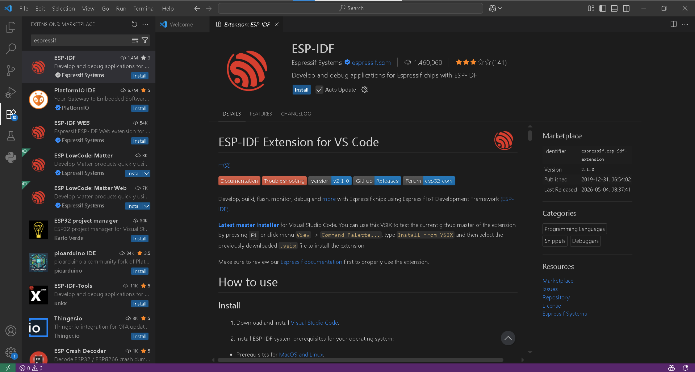
        <figcaption>Figura 1 — Ícone de Extensões no VS Code.</figcaption>
    </figure>

2.  Na barra de pesquisa, digitar **ESP-IDF** e clicar na extensão oficial da Espressif Systems.
    <figure style="text-align:center">
        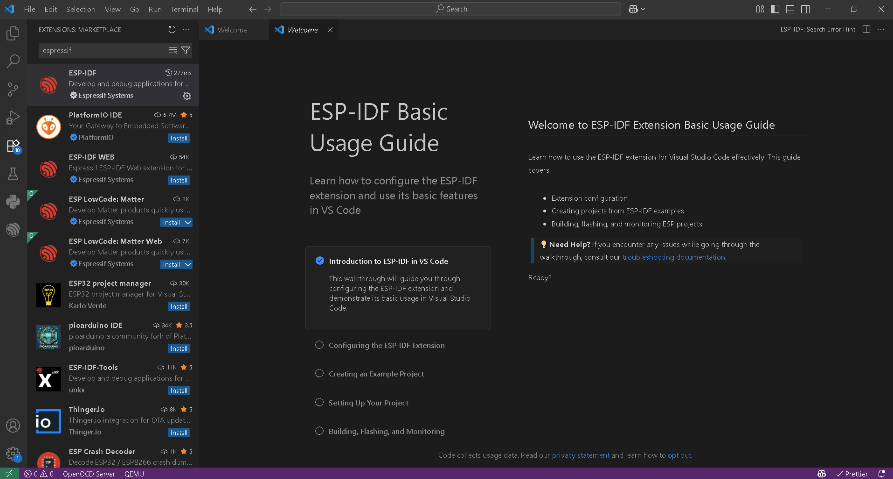
        <figcaption>Figura 2 — Pesquisar e localizar a extensão ESP-IDF.</figcaption>
    </figure>

3.  Clicar no botão **Instalar** para iniciar a instalação da extensão.

    > Selecionar a opção **Github** dentre as opções que aparecerão no menu da parte superior (ver imagem abaixo).

    <figure style="text-align:center">
        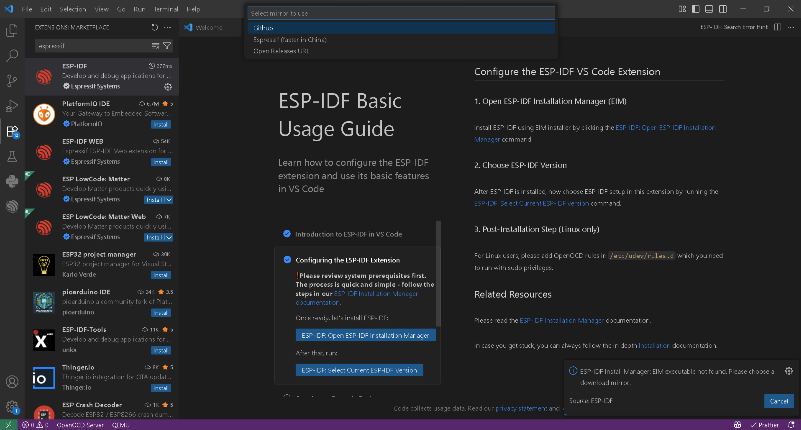
        <figcaption>Figura 3 — Botão de instalação da extensão ESP-IDF.</figcaption>
    </figure>

4.  Aguardar o andamento da instalação.

    <figure style="text-align:center">
        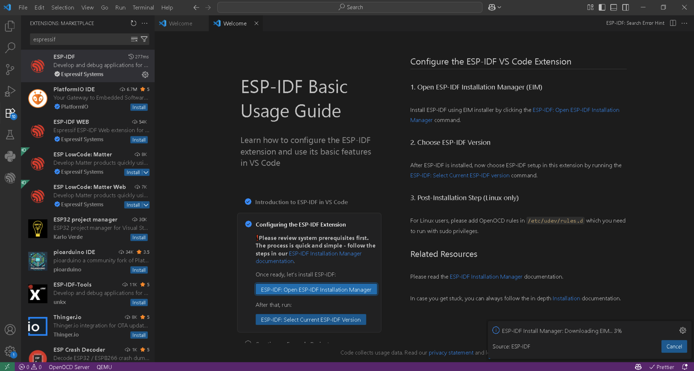
        <figcaption>Figura 4 — Progresso da instalação da extensão.</figcaption>
    </figure>

5.  Uma vez que a instalação da extensão for concluida, o **Instalation Manager** será aberto automaticamente. Ele irá guiar o usuário por todo o processo de instalação do ambiente de desenvolvimento, incluindo a instalação do **ESP-IDF**, **Python**, **Toolchain** e outras dependências necessárias para o desenvolvimento com os microcontroladores da Espressif.

    <figure style="text-align:center">
        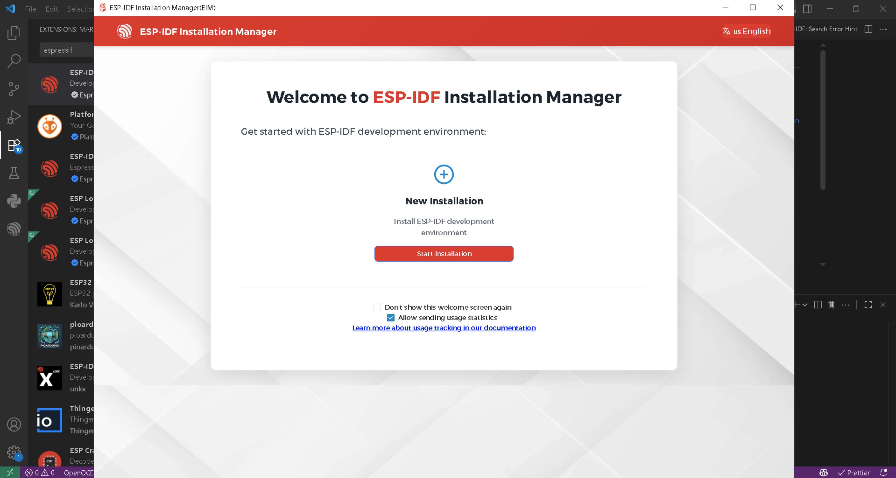
        <figcaption>Figura 5 — Installation Manager guiando a instalação do ESP-IDF.</figcaption>
    </figure>

6.  Clicar em **Custom Installation**, pois o workshop utiliza a versão **5.3.5** da **SDK**, e se for escolhida a opção **Easy Installation**, a versão mais recente da SDK será instalada (6.0.1).

    > Não há problemas em selecionar a opção **Easy Installation**, mas será necessário adequar o código do workshop.

    <figure style="text-align:center">
        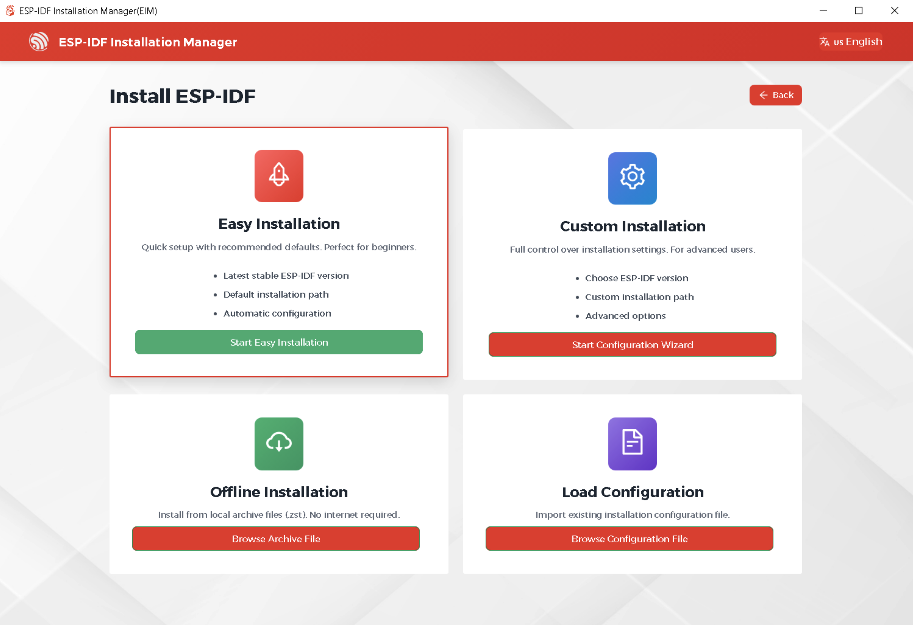
        <figcaption>Figura 6 — Seleção de "Custom Installation".</figcaption>
    </figure>

7.  Selecionar **ESP32C6**, pois o workshop utiliza a placa **ESP32C6-DevKitM**.

    <figure style="text-align:center">
        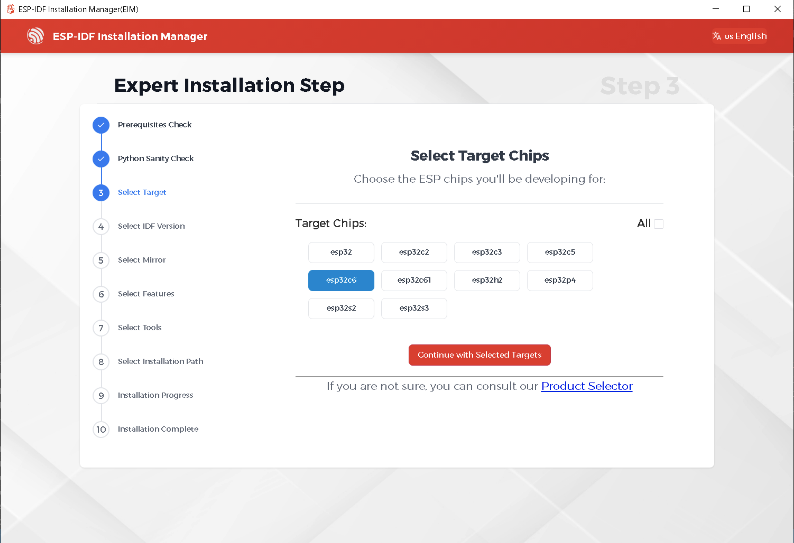
        <figcaption>Figura 7 — Selecionar o alvo ESP32C6.</figcaption>
    </figure>

8.  Selecionar a versão **5.3.5** da SDK, pois o workshop utiliza essa versão.

    > Voce pode selecionar mais de uma versão da SDK, e posteriormetne escolher uma para compilação. Para o workshop, foram testadas as versões **5.3.5** e **6.0.1**, e ambas funcionaram perfeitamente (Porém a ultima requer configuraçoes adicionais).

    <figure style="text-align:center">
        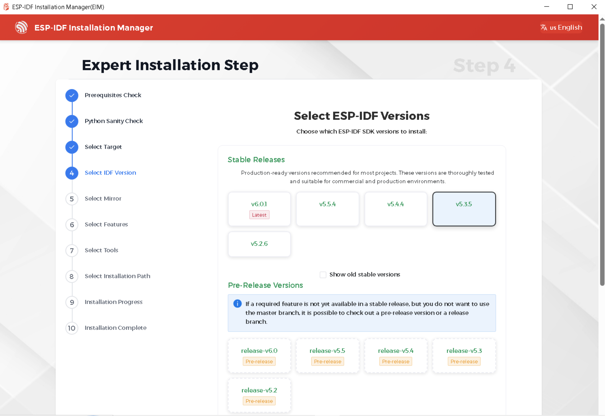
        <figcaption>Figura 8 — Escolha da versão 5.3.5 do ESP-IDF.</figcaption>
    </figure>

9.  Nos proximos passos, mantenhas as opções de instalação padrão, clicando em **Continue with ...**

    

    <figure style="text-align:center">
        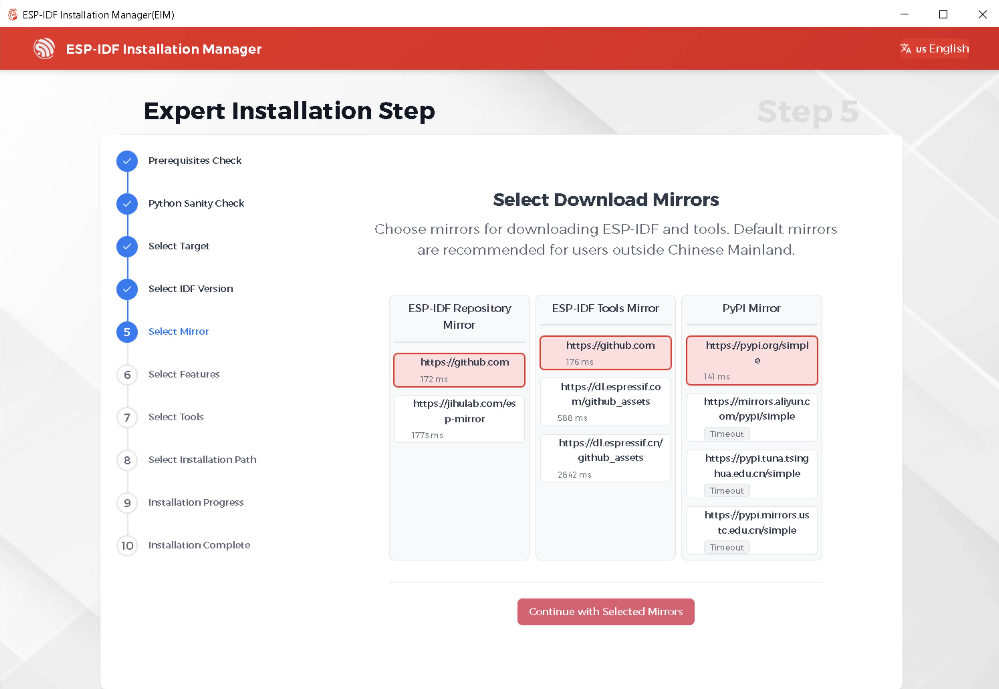
        <figcaption>Figura 9 — Tela de opções durante a instalação (parte 1).</figcaption>
    </figure>
    <figure style="text-align:center">
        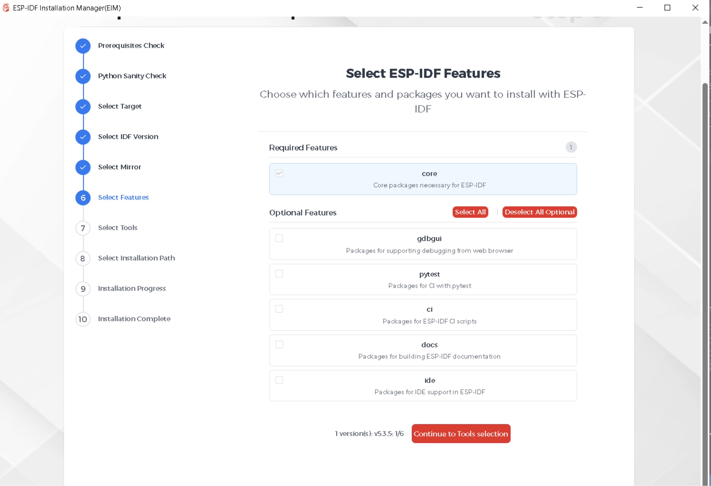
        <figcaption>Figura 10 — Tela de opções durante a instalação (parte 2).</figcaption>
    </figure>
    <figure style="text-align:center">
        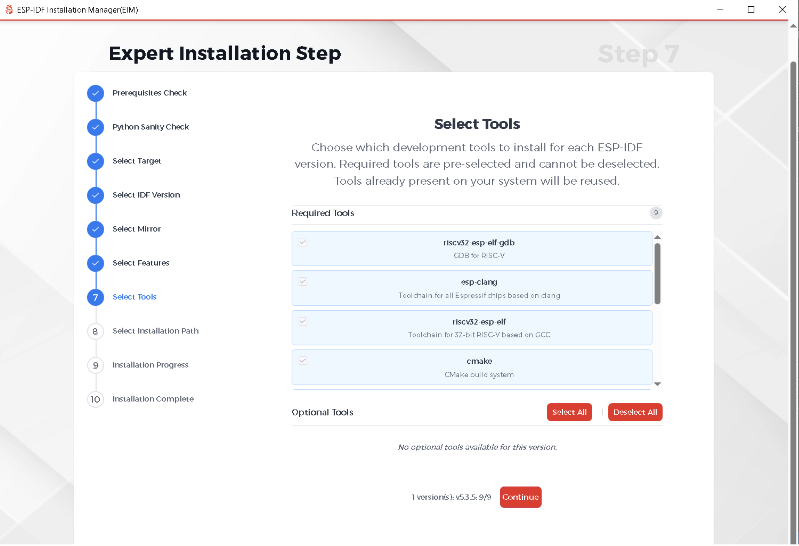
        <figcaption>Figura 11 — Tela de opções durante a instalação (parte 3).</figcaption>
    </figure>
    <figure style="text-align:center">
        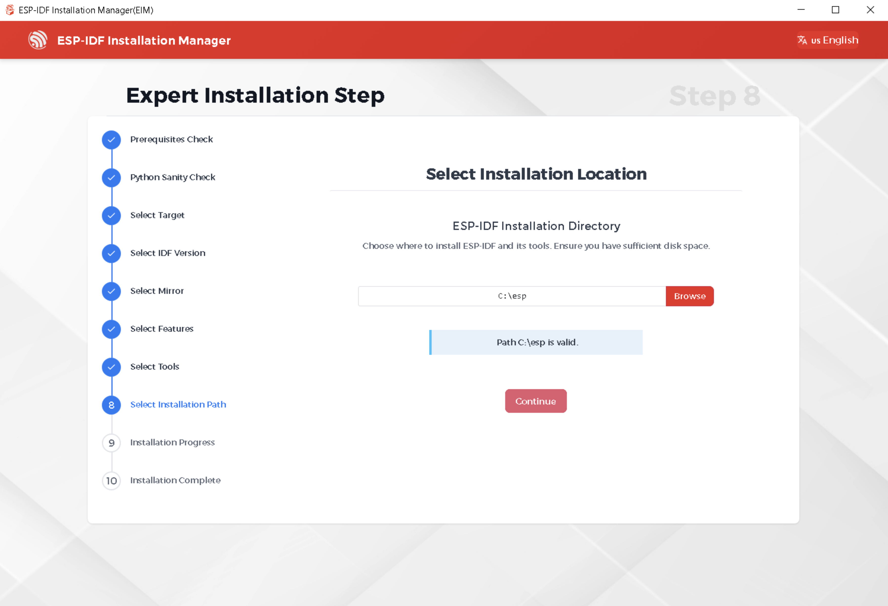
        <figcaption>Figura 12 — Tela de opções durante a instalação (parte 4).</figcaption>
    </figure>
    

10. Aguardar o andamento da instalação, que pode levar alguns minutos, dependendo da velocidade da internet e do computador.

    > Obs, em determinado momento, em ambiente **Windows**, a instalação do **Python** abre o **PowerShell** e aparenta estar travada, mas isso é normal, basta aguardar a conclusão da instalação do Python.

    <figure style="text-align:center">
        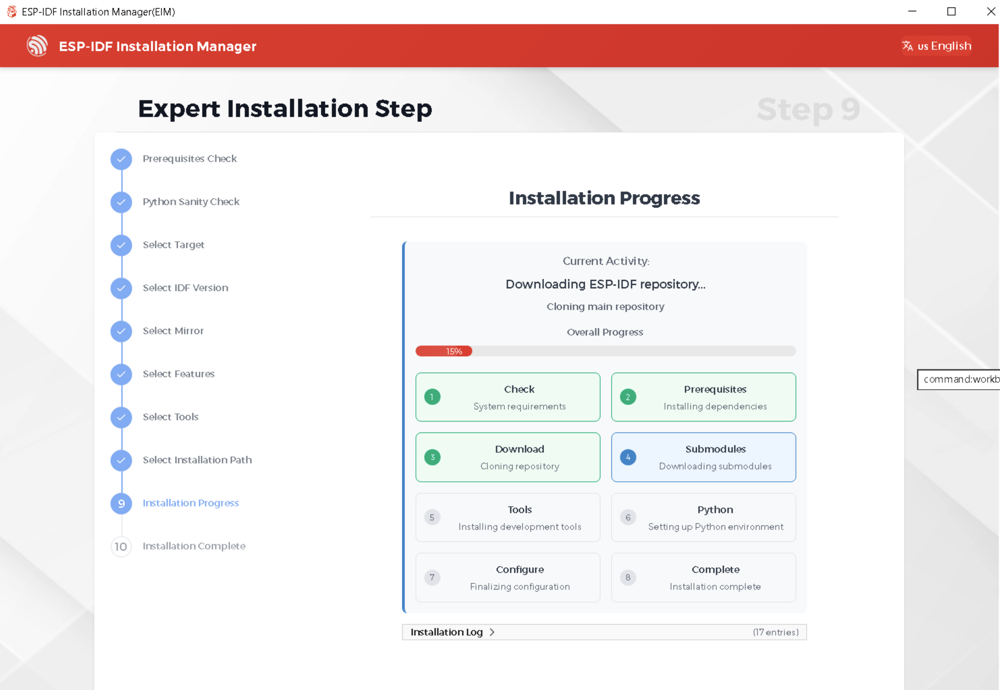
        <figcaption>Figura 13 — Instalação em andamento (exemplo de progresso).</figcaption>
    </figure>

11. Após a conclusão da instalação, clicar em **Exit Installer** para finalizar o processo.

    <figure style="text-align:center">
        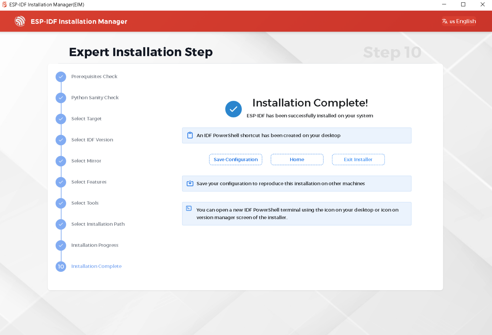
        <figcaption>Figura 14 — Botão "Exit Installer" após conclusão.</figcaption>
    </figure>

12. Uma vez que a instalação for concluida, a extensão do ESP-IDF estará pronta para ser utilizada no desenvolvimento de projetos com os microcontroladores da Espressif.

    <figure style="text-align:center">
        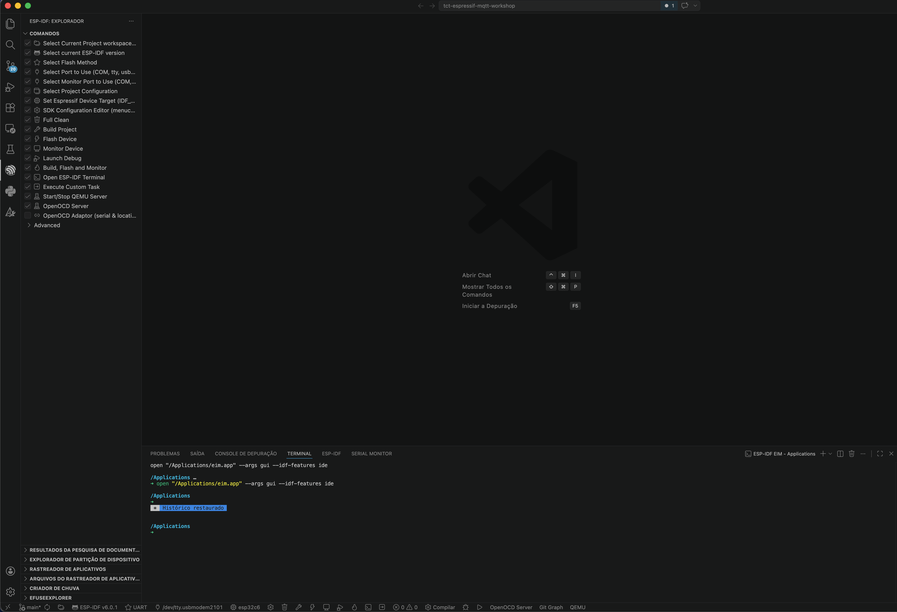
        <figcaption>Figura 15 — Painel do ESP-IDF no VS Code após instalação.</figcaption>
    </figure>

    No menu da esquerda pode ser visto o ícone do **ESP-IDF**, onde é possível acessar diversas funcionalidades da extensão, como a criação de novos projetos, configuração do ambiente, monitoramento da porta serial, entre outras.

    Na barra inferior do VS Code, temos uma barra com diversos icones, onde se pode selecionar a versão da SDK, a porta serial, o microcontrolador alvo, entre outras configurações importantes para o desenvolvimento com o ESP-IDF.

13. Na barra inferior, em **Flash Method**, sellecionar a opção **UART**.

    <figure style="text-align:center">
        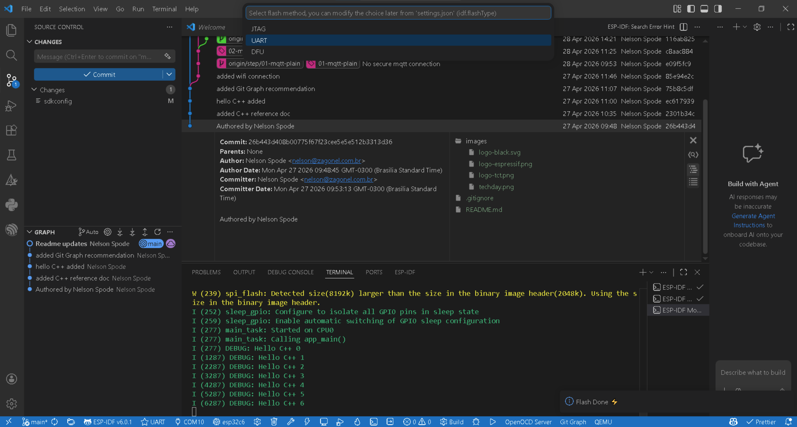
        <figcaption>Figura 16 — Seleção de método de flash: UART.</figcaption>
    </figure>

14. Verificar qual a **COM** utilizada pelo kit, e selecionar a porta correta em **Serial Port**. Para verificar a porta COM, basta abrir o **Gerenciador de Dispositivos** do Windows, e procurar por **Portas (COM e LPT)**, onde será possível identificar a porta COM utilizada pelo kit.

    

    <figure style="text-align:center">
        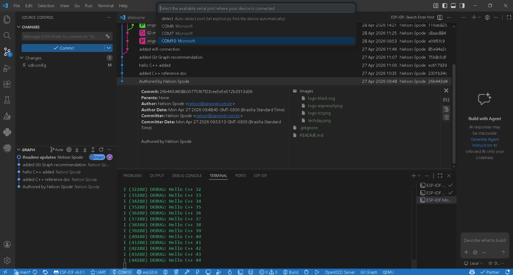
        <figcaption>Figura 17 — Seleção da porta serial (Serial Port).</figcaption>
    </figure>
    <figure style="text-align:center">
        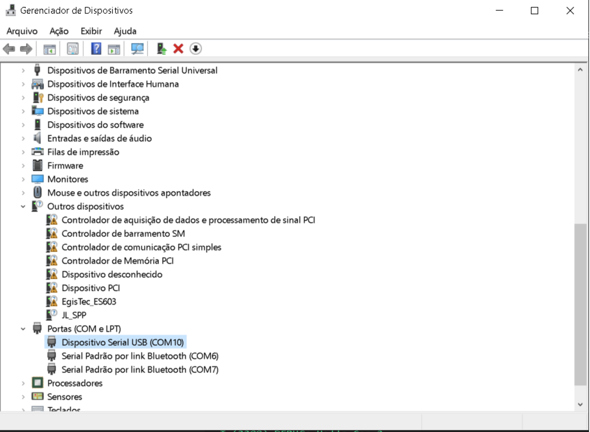
        <figcaption>Figura 18 — Informações da porta serial e configuração.</figcaption>
    </figure>
    

